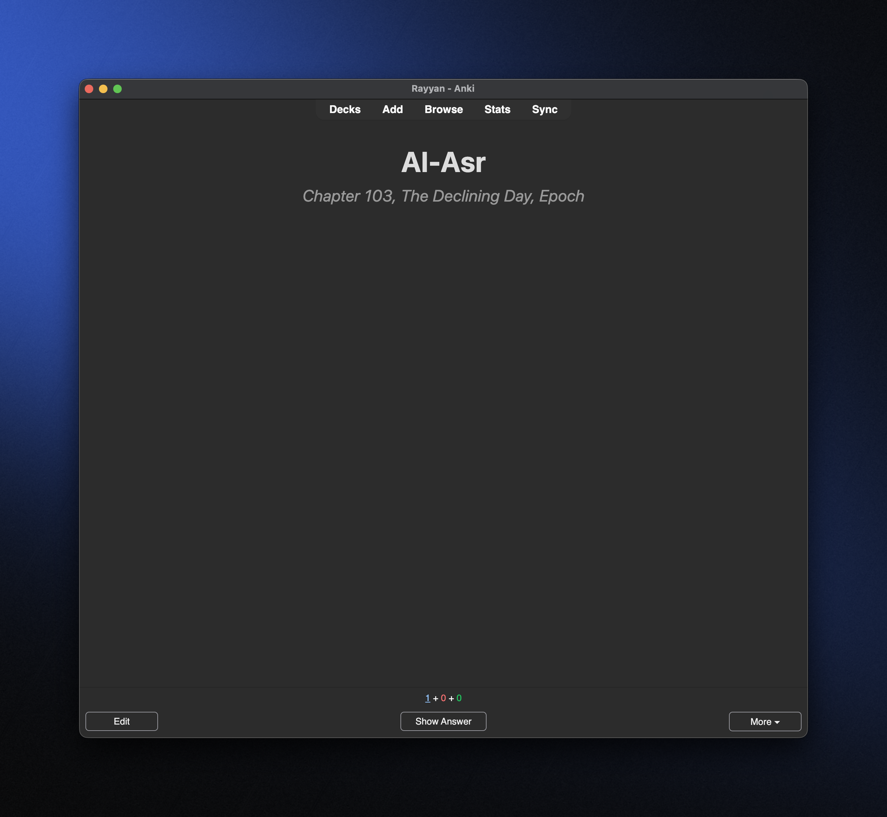
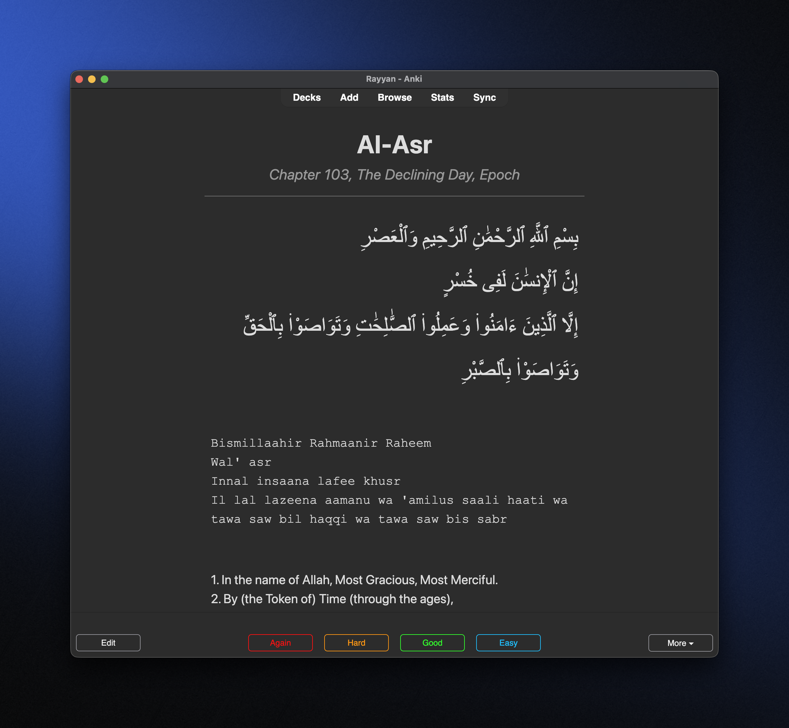

# Surah Cards Generator for Anki
[](https://github.com/iamrayyaann/surah-cards-anki/blob/main/LICENSE)

Generate Anki flashcards for Quran Surahs using the [Al-Quran Cloud API](https://alquran.cloud/api). Creates clean, minimal cards with Arabic (Uthmani), transliteration, and translation.

<image-card alt="Front of Al-Fatiha card" src="screenshots/al-fatiha-front.png" ></image-card>
<image-card alt="Back of Al-Fatiha card" src="screenshots/al-fatiha-back.png" ></image-card>

## Features
- **Dynamic Cards**: Pulls Surah data (Arabic, transliteration, translation) via API.
- **Customizable Range**: Generate any Surahs (e.g., `1`, `110-114`, `1,78,112`).
- **Minimal Design**: Large Arabic text (RTL), left-aligned transliteration/translation, title-case Surah names.
- **Anki-Compatible**: Outputs CSV with fields for `RomanizedTitle`, `ChapterInfo`, `Arabic`, `Transliteration`, `Translation`.

## Prerequisites
- **Python 3.8+**: Install from [python.org](https://www.python.org/downloads/).
- **Requests Library**: `pip install requests`.
- **Anki**: Install from [apps.ankiweb.net](https://apps.ankiweb.net).
- Arabic font may require "Traditional Arabic" or "Scheherazade" installed.

## Setup
1. Clone this repo:
   ```bash
   git clone https://github.com/yourusername/surah-anki-deck.git
   cd surah-anki-deck
   ```
2. Install dependency:
    ```bash
    pip install requests
    ```
3. Import the Anki note type:
- In Anki: File > Import > Select surah_cards.apkg.
- Creates "Surah Card" note type with templates.

## Usage
Run the script to generate cards:
    ```bash
    python3 generate_surah_cards.py "110-114"
    ```
- Outputs `surahs.csv`.
- Import into Anki:
    - File > Import > Select surahs.csv.
    - Set encoding to UTF-8, map fields to RomanizedTitle, ChapterInfo, Arabic, Transliteration, Translation.
    - Choose your deck (e.g., "Quran Surahs").
    - Check "Allow HTML in fields".

## Preview


